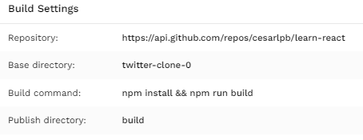

# learn-react - CEN

<!-- Cómo iniciar un proyecto de React
Cómo añadir una librería
Cómo añadir Clerk
Cómo subir el proyecto a Fleek -->

## Proyectos

[Twitter Clone](./twitter-clone-0)

- Enlace a la app (bird): https://morning-hat-8137.on.fleek.co/

- Pepe version: https://green-lab-6775.on.fleek.co

### Configuración deploy en Fleek
**NPM:**
<br>


[Twitter Clone v1](./twitter-clone-1/)

**Rutas:**
<br>
```
  npm install react-router-dom
```
- 6.14.1
- Basic: https://github.com/remix-run/react-router/tree/dev/examples/basic/src
- Tutorial: https://reactrouter.com/en/main/start/tutorial

**Clerk**
<br>
Instalamos la librería de Clerk para React:
```
  npm install @clerk/clerk-react
```
- Creamos .env con "publishable key" > `API Keys`
- Tutorial de Clerk: https://clerk.com/docs/quickstarts/get-started-with-create-react-app

**Iconos**

https://react-icons.github.io/react-icons

```
npm install react-icons --save
```

```
import { LiaKiwiBirdSolid } from "react-icons/lia";
```

```
  <LiaKiwiBirdSolid />
```

**antd**
Componentes de React -> https://ant.design/docs/react/use-with-create-react-app

```
  npm install antd --save
```

[Twitter Clone v2](./twitter-clone-2/)

`useState` y `useEffect`. Teoría en: https://www.w3schools.com/react/react_hooks.asp

## Referencias

- W3schools: https://www.w3schools.com/react/react_getstarted.asp
- Tutorial de Twitter clone: https://nicotsou.com/react-twitter-clone/
