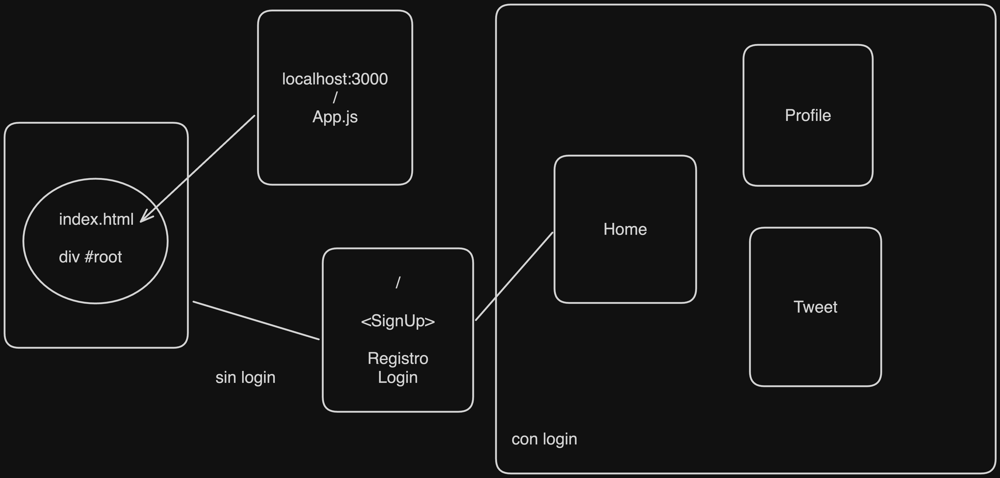
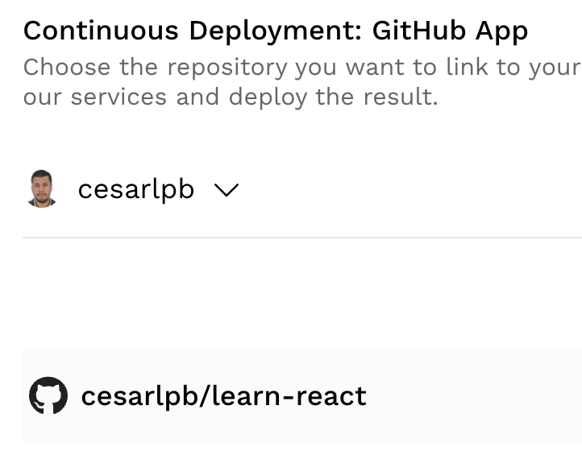
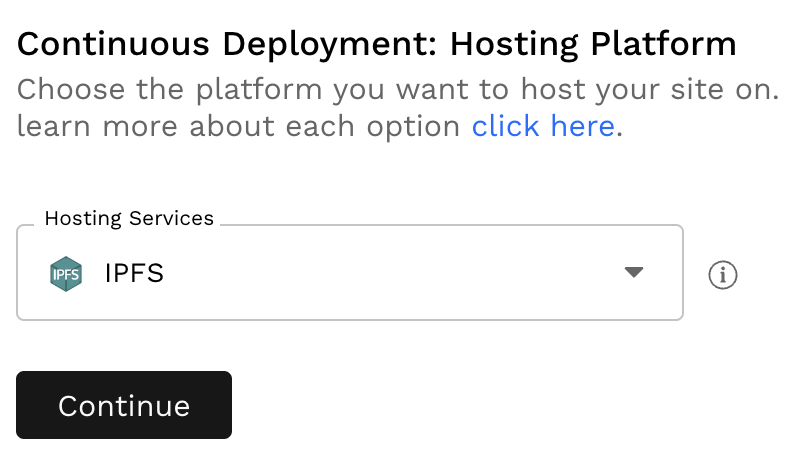
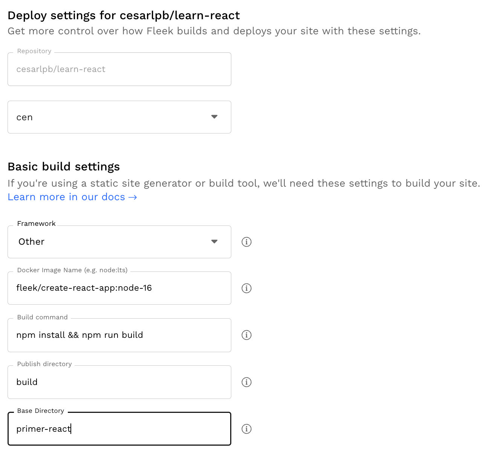

# learn-react - CEN

## Proyectos

[primer-react](./primer-react/) Primer proyecto de React con `create-react-app` y `npm`.

### Twitter clone
[twitter-clone-0](./twitter-clone-1/) Primera parte del proyecto de clon de Twitter con `create-react-app` y `npm`.
[twitter-clone-1](./twitter-clone-1/) Segunda parte del proyecto de clon de Twitter con `create-react-app` y `npm`.
#### Rutas
  - Instalamos `react-router-dom` para las rutas.
    ```
      npm install react-router-dom
    ```
  - Usamos la versión `6.14.1` de React Router DOM. Referencias:
    - [Basic](https://github.com/remix-run/react-router/tree/dev/examples/basic/src)
    - [Tutorial](https://reactrouter.com/en/main/start/tutorial)

#### Clerk
  - Instalamos la librería de [Clerk](https:/clerk.com/) para la autenticación:
    ```
      npm install @clerk/clerk-react
    ```
  - Pasos en [Tutorial de Clerk](https://clerk.com/docs/quickstarts/get-started-with-create-react-app)

  🐦App en Fleek: https://enjoyed-serval-30.accounts.dev/sign-in

## Rutas en React

Diagrama:
<br>


---

Proyecto creado con `npx create-react-app primer-react`. Se puede usar en Github con la [imagen de React en Codespaces](https://github.com/github/codespaces-react). Estos codespaces se pueden guardar como respositorios.

## Estructura de archivos

```
  primer-react
    node_modules
    public
      index.html
      favicon.ico
    src
      App.css
      App.js
      App.test.js
      index.css
      index.js
      logo.svg
      reportWebVitals.js
      setupTests.js
    .gitignore
    package-lock.json
    package.json
    README.md
```

  - `node_modules`: contiene las dependencias del proyecto.
  - `public`: contiene los archivos estáticos del proyecto.
    `index.html`: es el archivo principal del proyecto. Aquí podemos colocar metatags, estilos previos a la carga de React (spinner), etc. **Es el único HTML de todo el proyecto**. Por eso se le llama **Single Page Application**. Por eso no se puede hacer SEO con React, para eso se necesita `NextJS`.
  - `src`: contiene los archivos fuente del proyecto.
    - `App.js`: es el componente principal del proyecto.
    - `index.js`: es el punto de entrada del proyecto.

## Producción
Para crear el `build`de producción se usa el comando:
```
npm run build
```
Aparece una carpeta `build` con los archivos del proyecto.

Para servir el build de producción (comprobamos que funcione):
Instalamos `serve` (solo la primera vez):
```
npm install -g serve
```
Ejecutamos el build de producción:
```
serve -s build
```
También aparece en `localhost:3000` y en vuestra IP en la red local.
## Deploy en Fleek
- Crear cuenta en [Fleek](https://fleek.co/). Es un servicio de hosting para aplicaciones descentralizadas. Se puede conectar con Github y hacer deploy automático.

- **Add new site**
Conectad a Github y seleccionad repositorio:

Siguiente paso, continuar:

Configuración para el deploy:

  - Repository: seleccionar el repositorio en el paso anterior.
  - Branch: `main` por defecto, en mi caso es `cen`.
  - Framework: `Other`.
  - Docker image: `fleek/create-react-app:node-16`
  - Build command: `npm install && npm run build`
  - Publish directory: `build`
  - Base directory: por defecto sería `./` o `vacío`, en mi caso: `primer-react`

Enlace a la app: https://morning-hat-8137.on.fleek.co/

## Referencias

- W3schools: https://www.w3schools.com/react/react_getstarted.asp
- Tutorial de Twitter clone: https://nicotsou.com/react-twitter-clone/